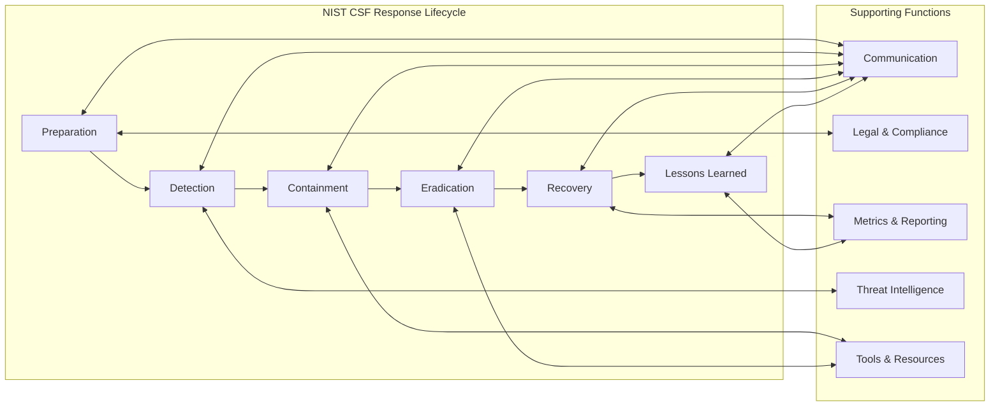

# Incident Response Playbook


A structured, open-source incident response guide organized by the **NIST Cybersecurity Framework** response lifecycle. Covers detection through post-incident review for the most common enterprise threat classes, with integrated tooling references for Splunk (SIEM) and Okta (IAM).

---

## 📋 Table of Contents

- [Overview](#-overview)
- [Architecture](#%EF%B8%8F-architecture)
- [Folder Structure](#folder-structure)
- [Tech Stack](#%EF%B8%8F-tech-stack)
- [How to Use](#how-to-use)
- [Quick Start](#-quick-start)
- [Related Projects](#-related-projects)
- [Author](#author)

---

## 📋 Overview

This playbook provides actionable, phase-by-phase response procedures for cybersecurity incidents ranging from phishing and credential compromise to ransomware and insider threats. Each folder maps to a specific phase of the IR lifecycle and includes templates, checklists, and automation scripts designed to **reduce mean time to respond (MTTR)**.

The playbook follows the **NIST Cybersecurity Framework** and is structured to integrate with enterprise tooling out of the box.

---

## 🏗️ Architecture



---

## Folder Structure

```
incident-response-playbook/
├── preparation/       Guides for training, risk assessments, and baseline configuration
├── detection/         Processes for identifying incidents using monitoring tools and threat intel
├── containment/       Strategies to limit damage: network segmentation, account lockdowns
├── eradication/       Procedures to remove malicious elements from systems and networks
├── recovery/          Steps to restore normal operations and verify no residual threats
├── legal-compliance/  Protocols for regulatory reporting and legal obligations
├── metrics-reporting/ Templates for tracking and reporting incident metrics
├── tools-resources/   Key tool references, checklists, and configurations
├── lessons-learned/   Post-incident review templates for continuous improvement
├── threat-intel/      Guidance on gathering, analyzing, and applying threat data
└── communication/     Stakeholder notification plans and evidence preservation protocols
```

---

## 🛠️ Tech Stack

| Tool | Role | Phase |
|---|---|---|
| Splunk (SIEM) | Centralized log management, threat detection, alerting | Detection, Metrics |
| Okta (IAM) | Access control, login monitoring, account lockdown | Containment |
| NIST CSF | Response framework and lifecycle organization | All phases |

**Splunk** — Used throughout the Detection and Metrics phases for correlation rules, dashboards, and rapid triage.

**Okta** — Enforces access control policies, monitors login activity, and enables rapid account lockdown during active incidents. Integrated into the Containment phase.

---

## How to Use

```bash
git clone https://github.com/TGKDre/incident-response-playbook.git
```

Navigate to the folder that matches your current response phase. Apply the markdown templates inside to guide your actions. Customize tool references, contact lists, and escalation paths to reflect your organization's environment before deploying.

---

## ⚡ Quick Start

For your first incident response run:

1. Start in **`preparation/`** to review baseline requirements and confirm tooling is in place
2. Move to **`detection/`** to identify the threat class
3. Follow **`containment/`** and **`eradication/`** to manage the active incident
4. Use **`recovery/`** and **`lessons-learned/`** to close out cleanly

For questions or tool-specific guidance, refer to the `tools-resources/` folder.

---

## 🔗 Related Projects

- [Agent Security Sandbox](https://github.com/TGKDre/agent-security-sandbox) — AI agent isolation and security testing
- [Autonomous Injection Agent](https://github.com/TGKDre/autonomous-injection-agent) — Automated penetration testing tool
- [LLM Redteam Harness](https://github.com/TGKDre/llm-redteam-harness) — LLM security assessment framework
- [SentryIQ](https://github.com/TGKDre/sentryiq) — AI-powered IAM risk auditor

---

## Author

Built by [Andre Uzoukwu](https://github.com/TGKDre) — [LinkedIn](https://linkedin.com/in/andre-uzoukwu-tgkdre)
